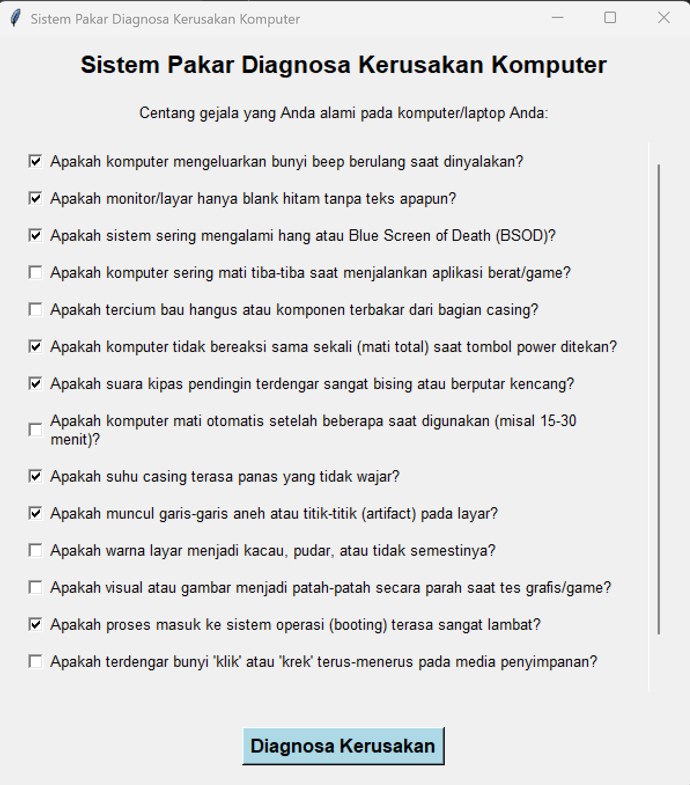
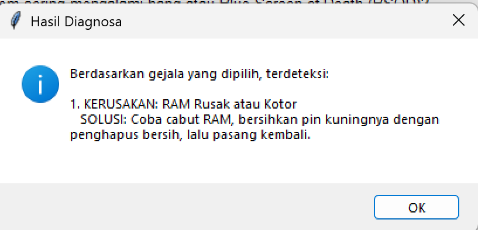

# LAPORAN PRAKTIKUM KECERDASAN BUATAN
## PERTEMUAN 4: SISTEM PAKAR (REPRESENTASI PENGETAHUAN & INFERENSI)

**Identitas Mahasiswa:**
- **Nama:** iqsan azhar n
- **NIM:** H1D024009
- **SHIFT AWAL:** A
- **SHIFT BARU:** B

---

## 1. Deskripsi Program
Program ini merupakan implementasi **Sistem Pakar** untuk mendiagnosa kerusakan perangkat keras (*hardware*) pada komputer atau laptop. Dikembangkan menggunakan bahasa pemrograman Python dengan pustaka **Tkinter** untuk antarmuka grafis (GUI). Sistem ini memungkinkan pengguna untuk memilih gejala yang dialami melalui daftar *checkbox* dan secara otomatis memberikan diagnosa beserta solusinya.

## 2. Struktur Kode dan Basis Pengetahuan

### A. Basis Pengetahuan (*Knowledge Base*)
Basis pengetahuan disimpan dalam struktur data dictionary `database_kerusakan`. Setiap entri mewakili satu jenis kerusakan yang memiliki:
- **`gejala`**: Himpunan (*set*) kode gejala unik yang harus dipenuhi untuk mencapai kesimpulan tersebut.
- **`solusi`**: Langkah-langkah perbaikan yang disarankan.

*Contoh Kerusakan:* RAM Rusak, PSU Lemah, Overheat, VGA Bermasalah, dan Hardisk/SSD Corrupt.

### B. Daftar Gejala (*Working Memory*)
Sistem memiliki data `semua_gejala` yang memetakan kode internal ke deskripsi tekstual yang dapat dibaca manusia. Data ini digunakan untuk membangun elemen antarmuka pengguna secara dinamis.

### C. Mesin Inferensi (*Inference Engine*)
Aplikasi menggunakan metode **Forward Chaining** (Runut Maju) sederhana. Logika pengambilan keputusannya dilakukan dengan pengecekan himpunan bagian (*Subset Check*):
```python
if gejala_syarat.issubset(gejala_pasien):
    penyakit_terdeteksi.append((nama_penyakit, data["solusi"]))
```
Sistem akan memeriksa apakah seluruh kumpulan syarat dari suatu kerusakan merupakan bagian dari gejala yang dicentang oleh pengguna (`gejala_pasien`).

### D. Antarmuka Pengguna (GUI)
Aplikasi dibungkus dalam kelas `SistemPakarGUI` yang menangani:
- Pembuatan jendela utama dan *scrolling* untuk daftar gejala yang panjang.
- Penangkapan *state* boolean dari setiap *checkbox*.
- Penampilan hasil melalui *message box* (dialog pop-up).

## 3. Cara Menjalankan Program

Akses folder `tugas` melalui terminal, kemudian jalankan:
```bash
python tugas_sistem_pakar.py
```

## 4. Hasil dan Visualisasi Output
Aplikasi ini menyertakan visualisasi hasil eksekusi program untuk memberikan gambaran antarmuka dan proses diagnosa secara nyata. Folder `output/` berisi tangkapan layar (screenshot) dari sistem pakar saat dijalankan.

### Tampilan Antarmuka Grafis (GUI)
Pengguna dapat memilih gejala melalui checkbox yang tersedia secara interaktif.


### Tampilan Hasil Diagnosa
Setelah tombol ditekan, sistem akan memproses fakta yang ada dan menampilkan hasil diagnosa melalui jendela dialog.


---
*Laporan ini disusun sebagai bagian dari tugas Praktikum Kecerdasan Buatan - Pertemuan 4.*
